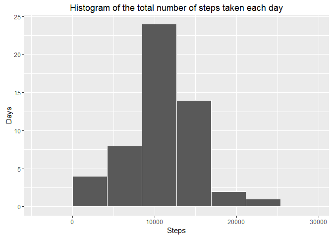
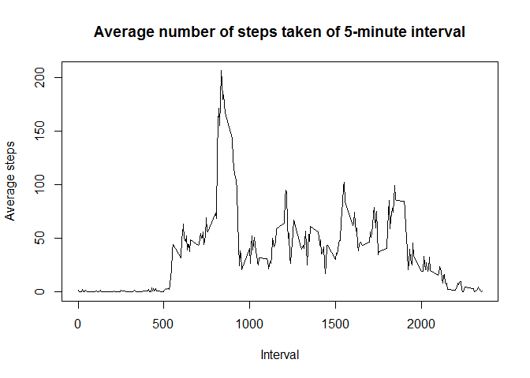
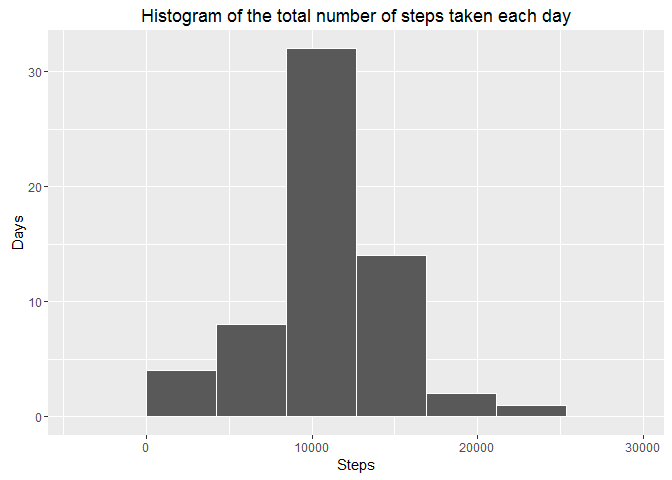

# Reproducible Research: Peer Assessment 1


## Loading and preprocessing the data

```r
library(dplyr)
```

```
## Warning: package 'dplyr' was built under R version 3.2.3
```

```
## 
## Attaching package: 'dplyr'
```

```
## The following objects are masked from 'package:stats':
## 
##     filter, lag
```

```
## The following objects are masked from 'package:base':
## 
##     intersect, setdiff, setequal, union
```

```r
library(ggplot2)
```

```
## Warning: package 'ggplot2' was built under R version 3.2.3
```

```r
dataset <- read.csv(unz("activity.zip", "activity.csv"))
dataset$date <- as.Date(dataset$date, "%Y-%m-%d")
```


## What is mean total number of steps taken per day?
Create function to show plot with mean and median, because we need to call it again later

```r
showMeanMedianByDate <- function (showme) {
  # Group data by date and summarize it by taking sum of steps
  showme.bydate = showme %>% 
    filter(!is.na(steps)) %>%
    group_by(date) %>% 
    summarize(steps = sum(steps))
  
  print(ggplot(showme.bydate, aes(steps)) +
    labs(title="Histogram of the total number of steps taken each day") +
    labs(x="Steps", y="Days") +
    geom_histogram(bins=5, col="white"))
  
  cat(paste(
    "Mean and median of the total number of steps taken per day:",
    mean(showme.bydate$steps), 
    "and", 
    median(showme.bydate$steps)))
}

showMeanMedianByDate(dataset)
```



```
## Mean and median of the total number of steps taken per day: 10766.1886792453 and 10765
```


## What is the average daily activity pattern?

```r
# Group data by interval and summarize it by using mean of steps
dataset.bytime <- dataset %>%
  filter(!is.na(steps)) %>%
  group_by(interval) %>%
  summarize(steps = mean(steps))

with(dataset.bytime, plot(
  interval, 
  steps, 
  type="l",
  main="Average number of steps taken of 5-minute interval",
  xlab="Interval",
  ylab="Average steps"))
```



```r
cat(paste(
  "5-minute interval, on average across all the days in the dataset,",
  "contains the maximum number of steps:",
  dataset.bytime[which.max(dataset.bytime$steps),]$interval))
```

```
## 5-minute interval, on average across all the days in the dataset, contains the maximum number of steps: 835
```


## Imputing missing values

```r
print(paste(
  "Total number of missing values in the dataset:",
  sum(!complete.cases(dataset))
))
```

```
## [1] "Total number of missing values in the dataset: 2304"
```

```r
# NA values are only in dataset steps column.
# I will fill all missing values using mean for that 5-minute interval
# Table dataset.bytime contains averaged (by interval) number of steps
# So we need to merge these two tables together (by interval column)
# And fix steps column by replacing NA values to corresponding average
dataset.fixed <- merge(dataset, dataset.bytime, by="interval") %>%
  rename(steps=steps.x, steps.mean=steps.y) %>%
  mutate(steps=ifelse(is.na(steps),steps.mean,steps)) %>%
  arrange(date, interval)

# Make histogram of number of steps and report mean and median
showMeanMedianByDate(dataset.fixed)
```



```
## Mean and median of the total number of steps taken per day: 10766.1886792453 and 10766.1886792453
```


Because we fixed NA values of steps by using average number of steps in the particular interval,
our mean value of number of steps is unchanged. In original dataset each number of steps is integer value, and median value for original dataset is integer too. But, in fixed dataset, we now have a lot of floating point values, so our median is now equal to mean.


## Are there differences in activity patterns between weekdays and weekends?

```r
dataset.fixed$week <- weekdays(dataset.fixed$date) %in% c("Saturday", "Sunday")
dataset.fixed$week <- factor(dataset.fixed$week, labels=c("weekday","weekend"))

# Group data set by interval and week and summarize it using mean of steps
dataset.week <- dataset.fixed %>%
  group_by(interval, week) %>%
  summarize(steps = mean(steps))

# I will draw plots by using facets on column week
# Because column week has 2 factors (weekend and weekday) we will get two plots
# Draw each plot as line by using interval and steps values
print(ggplot(dataset.week, aes(interval, steps)) + 
      geom_line() + 
      xlab("Interval") + ylab("Number of steps") +
      facet_wrap(~week, ncol=1))
```


